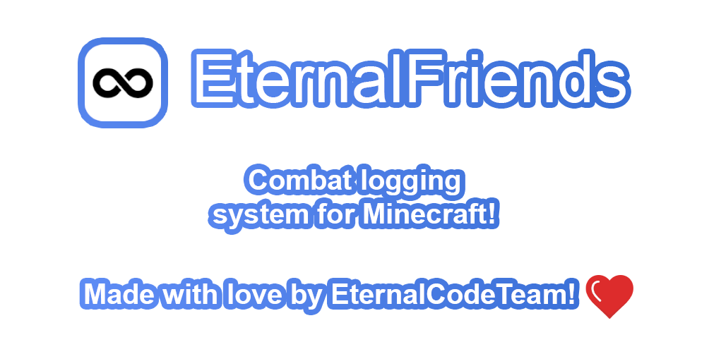

<div align="center">



[](https://papermc.io)
[](https://spigotmc.org)

[](https://www.patreon.com/eternalcode)
[](https://eternalcode.pl/)
[](https://discord.gg/FQ7jmGBd6c)

[](https://gradle.org/)
[](https://www.java.com/)

</div>

# Building

To build EternalFriends do the following (Make sure you have JDK 17 or higher)

```
./gradlew shadowJar
```

- #### Output file will be located at build/libs

# Contributing

Create a public EternalFriends fork, make changes and then create a Pull Request
See [CONTRIBUTING.md](https://github.com/EternalCodeTeam/EternalCore/blob/master/.github/CONTRIBUTING.md) to find out
more.

# Other Dependencies usages

- [LiteCommands (by Rollczi ❤   )](https://github.com/Rollczi/LiteCommands)
- [Spigot API](https://www.spigotmc.org/wiki/spigot-gradle/)
- [Adventure](https://docs.adventure.kyori.net/)
- [CDN](https://github.com/dzikoysk/cdn)
- [bStats](https://bstats.org/)
- [TriumphGUI](https://github.com/TriumphTeam/triumph-gui)
