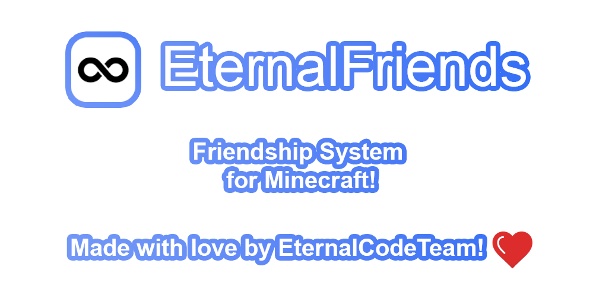

## About EternalFriends

EternalFriends is a plugin that allows you to manage your friends' list. It is a comprehensive solution that provides
perfect friends system in your Minecraft server.

## Plugin preview

TODO here!

## Permission Assignments

| Permission                    | Description                                                                                        | Sub-permissions                                                                                                                                                                                                                                                     | 
|-------------------------------|----------------------------------------------------------------------------------------------------|---------------------------------------------------------------------------------------------------------------------------------------------------------------------------------------------------------------------------------------------------------------------| 
| **eternalfriends.access.all** | Gives access to all basic command functionality. By default, this is assigned to server operators. | **eternalfriends.access.gui**, **eternalfriends.access.accept**, **eternalfriends.access.deny**, **eternalfriends.access.help**, **eternalfriends.access.ignore**, **eternalfriends.access.invite**, **eternalfriends.access.kick**, **eternalfriends.access.list** | 
| **eternalfriends.admin.all**  | Gives access to all administrative commands. By default, this is assigned to server operators.     | **eternalfriends.admin.list**, **eternalfriends.admin.reload**                                                                                                                                                                                                      | 

## For Developers

Details on how to contribute, build process and more can be found below.

### Build Process

Use the command `./gradlew shadowJar` to build the project.

The output file `EternalFriends-<version>.jar` will be located in the `build/libs` directory.

### Contributions

We wholeheartedly welcome your contributions to EternalFriends! Please refer to
our [contribution guidelines](.github/CONTRIBUTING.md) for detailed procedures on how you can contribute, and
our [code of conduct](./.github/CODE_OF_CONDUCT.md) to ensure a harmonious and welcoming community.

### Issue Reporting

Experiencing an issue with the plugin? Report it under
our [Issues tab](https://github.com/EternalCodeTeam/EternalFriends/issues). Be sure to provide maximum information, such as
your Minecraft version, plugin version, and relevant error messages or logs for an efficient diagnosis.